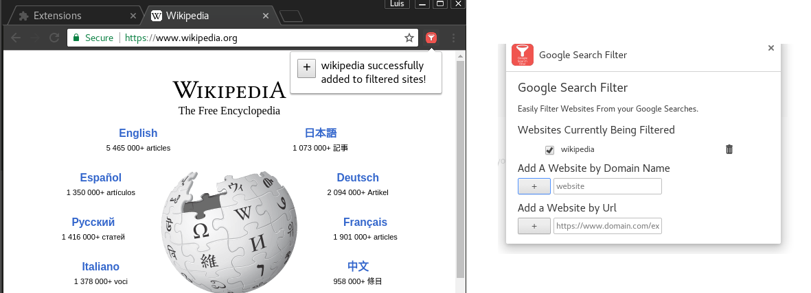
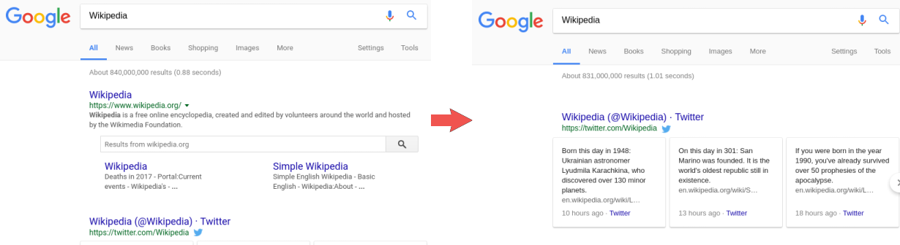

# Google Search Filter
A Google Chrome extension that filters Google Search results based on domain name.

## Description
TODO:

## Examples
Add website domain through the options section, or with by using the browser popup.

#### Before And After:

## Technologies Used
* Javascript
* Chrome Storage API
* Chrome Tabs API
* JQuery

## Install

### Unpacked Extension
* Download the code, unzip
* Open (chrome://extensions/) or select the menu 'Window > Extensions.'
* Enable developer mode at top right.
* Click 'Load unpacked extension...' and select the source code folder.
* Search with Google

### Chrome Web Store
**_Coming Soon??_**
